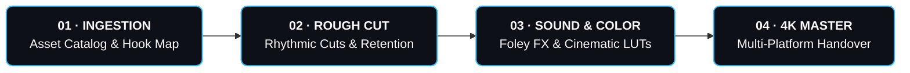

<div align="center">

  <!-- Dynamic Animated Hero Banner -->
  

  <p align="center">
    <strong>The next-generation cinematic portfolio & commercial brand collaboration platform for Bikash Suna.</strong><br />
    Engineered with <strong>React 18</strong>, <strong>Three.js (WebGL 3D)</strong>, <strong>Lenis Smooth Scroll</strong>, and a bespoke <strong>Cyber Cinema Glassmorphic Design System</strong>.
  </p>

  <!-- Live Status & Technology Badges -->
  <p align="center">
    <a href="https://react.dev/"></a>
    <a href="https://threejs.org/"></a>
    <a href="https://vitejs.dev/"></a>
    <a href="https://github.com/darkroomengineering/lenis"></a>
    <a href="https://wa.me/919360870164"></a>
    <a href="#-license"></a>
  </p>

  <!-- Quick Action Navigation Badges -->
  <p align="center">
    <a href="https://wa.me/919360870164?text=Hi%20Bikash,%20I'm%20interested%20in%20hiring%20you%20for%20a%20project!">
      
    </a>
    &nbsp;
    <a href="#-core-features--architecture">
      
    </a>
    &nbsp;
    <a href="#-service-rate-matrix">
      
    </a>
    &nbsp;
    <a href="#-getting-started--local-setup">
      
    </a>
  </p>

</div>

---

## 📑 Quick Navigation Hub

<div align="center">

  <!-- Interactive Navigation Pill Badges -->
  <a href="#-executive-overview"></a>
  <a href="#-1-interactive-3d-webgl-gyro--particle-universe"></a>
  <a href="#-2-cinematic-hero--pure-diamond-ice-white-typography"></a>
  <a href="#-3-dual-superpowers--two-passions-one-powerful-creator"></a>
  <a href="#-4-cinema-studio-video-player--fullscreen-hud"></a>
  <br/>
  <a href="#-5-filterable-showreel-showcase"></a>
  <a href="#-6-creator-media-kit--live-analytics-desk"></a>
  <a href="#-service-rate-matrix"></a>
  <a href="#-7-clean-luxury-contact--instant-payments-suite"></a>
  <a href="#-8-right-sided-floating-whatsapp-concierge"></a>

</div>

<br/>

| Section Pillar | Focus & Direct Deep Links |
| :--- | :--- |
| **🌌 Visual & 3D Experience** | [🌟 Executive Overview](#-executive-overview) &nbsp;&bull;&nbsp; [🌌 3D WebGL Canvas](#-1-interactive-3d-webgl-gyro--particle-universe) &nbsp;&bull;&nbsp; [🎬 Ice-White Hero Typography](#-2-cinematic-hero--pure-diamond-ice-white-typography) &nbsp;&bull;&nbsp; [📽️ Cinema Fullscreen HUD](#-4-cinema-studio-video-player--fullscreen-hud) &nbsp;&bull;&nbsp; [🎞️ Showreel Gallery](#-5-filterable-showreel-showcase) |
| **💼 Commercial & Collaboration** | [⚡ Dual Superpowers](#-3-dual-superpowers--two-passions-one-powerful-creator) &nbsp;&bull;&nbsp; [📊 Creator Media Kit](#-6-creator-media-kit--live-analytics-desk) &nbsp;&bull;&nbsp; [💰 Service Rate Matrix](#-service-rate-matrix) &nbsp;&bull;&nbsp; [🛠️ 4-Phase Pipeline](#️-4-phase-creative-production-pipeline) &nbsp;&bull;&nbsp; [💳 Instant UPI Payments](#-7-clean-luxury-contact--instant-payments-suite) &nbsp;&bull;&nbsp; [💬 WhatsApp Concierge](#-8-right-sided-floating-whatsapp-concierge) |
| **⚙️ Engineering & Architecture** | [💻 Tech Stack & Architecture](#-tech-stack--dependencies) &nbsp;&bull;&nbsp; [📂 Repository Structure](#-comprehensive-project-structure) &nbsp;&bull;&nbsp; [🚀 Getting Started & Setup](#-getting-started--local-setup) &nbsp;&bull;&nbsp; [⚙️ Customization Guide](#️-customization-guide) &nbsp;&bull;&nbsp; [⚡ 60FPS Benchmarks](#-performance--optimization-standards) |

---

## 🌟 Executive Overview

This web platform is engineered as an ultra-high-end cinematic portfolio, creative showcase, and commercial booking desk for **Bikash Suna**. It reflects both complementary superpowers of his creative career:

1. **Elite Video Editor & Post-Production Specialist**: Precision narrative storytelling, retention-driven cuts, cinematic DaVinci color grading, immersive sound design, and viral pacing for short-form Reels, TikToks, and long-form YouTube documentary edits.
2. **High-Impact Content Creator & Brand Partner**: Authentic lifestyle & tech storytelling, verified creator presence, transparent media kit retention analytics, and instant direct brand collaboration funnels.

Every single interaction has been fine-tuned for visual excellence, fluid 60FPS motion, zero input latency, and seamless conversion-optimized client onboarding.

---

## ⚡ Core Features & Architecture

### 🌌 1. Interactive 3D WebGL Gyro & Particle Universe
* **Three.js Powered Viewport**: Real-time 3D canvas featuring concentric neon gimbal rings, a central camera aperture core, and an ambient celestial particle galaxy.
* **Physics Cursor Tracking**: Gyroscopic orientation responds dynamically to cursor coordinates on desktop, with continuous automated orbital drifting on touchscreens.
* **Smart Resource Management**: Frame render loop pauses when scrolled out of view, preserving battery life and eliminating GPU overhead.

### 🎬 2. Cinematic Hero & Pure Diamond Ice-White Typography
* **High-Contrast Headline Typography**: The rotating typewriter titles (*"Influential Content Creator"*, *"Cinematic Video Editor"*, *"Viral Reel Specialist"*, *"Brand Collab Partner"*) are rendered in a bespoke **Pure Diamond Ice-White with Platinum Glow** gradient (`#FFFFFF` &rarr; `#F8FAFC` &rarr; `#E2E8F0` &rarr; `#CBD5E1`).
* **Multi-Depth Platinum Aura**: Layered drop shadows (`rgba(255, 255, 255, 0.7)` and `rgba(226, 232, 240, 0.4)`) guarantee 100% legibility against dark studio backgrounds.
* **Studio Production Monitor Suite**: Real-time visualizer card displaying Premiere Pro and After Effects workflow previews, simulated playback controls, live frequency audio visualizers, and timecode readouts.
* **Live Verified Metrics**: Dynamic animated counters tracking 120+ projects completed, 4.9★ rating, and 100% client retention.

### ⚡ 3. Dual Superpowers: "Two Passions. One Powerful Creator."
* **Pillar 01 — Elite Video Editor & Colorist**:
  * Pacing, kinetic captions, sound design, multi-cam sync, and cinematic color grading.
  * Master software suite badges: Premiere Pro, After Effects, DaVinci Resolve, CapCut Pro.
  * Direct pricing anchors: Short Reels from **₹600**, Long Form from **₹3,000**.
* **Pillar 02 — High-Impact Content Creator**:
  * Authentic storytelling, organic lifestyle integration, viral reel strategies, and high-converting commercial CTAs.
  * Platforms: Instagram Reels, YouTube Shorts, and Brand Collabs.
  * Direct sponsorship anchor: Paid Collabs from **₹1,500**.
* **2-in-1 Synergy Banner**: Highlighting the hybrid Creator + Editor package for brands seeking all-in-one production, saving time and maximizing audience resonance.

### 📽️ 4. Cinema Studio Video Player & Fullscreen HUD
* **Studio Cinema Monitor Frame**: High-fidelity video player dialog with frosted glass header, glowing window status controls, and an active pulsing `REC` indicator.
* **Dual Fullscreen Engine**:
  * **Native Fullscreen API**: Leverages `requestFullscreen()` with graceful vendor prefix support (`webkit`, `moz`, `ms`) for true full-monitor immersion.
  * **Cinema Viewport Maximization HUD**: Custom fullscreen fallback that stretches seamlessly across the browser with floating player controls, audio toggle, and ESC key listener.
* **Interactive Media HUD**:
  * **SMPTE Timecode Reader**: Real-time elapsed / duration display (`00:00:18:14 / 00:01:24:00`).
  * **Cinematic Ken Burns Canvas**: Subtle pan and zoom dynamics simulating master footage.
  * **Live Audio Equalizer**: Dynamic animated frequency bars with one-click Mute/Unmute toggle.
  * **Interactive Scrubber Bar**: Scrubbable timeline with hover preview and progress filling.

### 🎞️ 5. Filterable Showreel Showcase
* **Zero-Lag Smooth Filtering**: Fast category switching between `All Work`, `Short Reels (9:16)`, `Cinematic Long Form (16:9)`, and `Brand Collabs`.
* **Hardware-Accelerated Transitions**: Pure opacity and transform scale animations (`portfolio-fade-in`) eliminating blur artifacts during filter changes.
* **Live Social Proof Badges**: Real view count metrics displayed on each card (e.g., `1.2M Views`, `850K Views`, `2.4M Views`).

### 📊 6. Creator Media Kit & Live Analytics Desk
* **Interactive SVG Sparkline Trends**: Dynamic SVG stroke curves visualizing consistent 30-day reach expansion.
* **Retention & Engagement Matrix**: Transparent metrics displaying 1.2M+ Monthly Reach, 98% Retention Rate, and 8.4% Average Engagement.
* **Demographic Breakdown**: Clean visual bars depicting core audience segments (18–24, 25–34, 35+).
* **4-Phase Production Pipeline**: Visual workflow map demonstrating systematic client delivery from Ingestion to 4K Master.

### 💳 7. Clean Luxury Contact & Instant Payments Suite
* **Direct Commercial Booking Hub**:
  * **WhatsApp Sponsor Desk**: Instant chat with pre-filled inquiry parameters (`+91 9360870164`).
  * **One-Click Mobile Call**: Immediate direct phone access (`+91 9360870164`).
  * **Instagram Creator Profile**: Official sunset-violet gradient badge routing directly to `@bikash_suna_07`.
  * **Studio Location**: Jharsuguda, Odisha, India.
* **Cyber Cinema UPI Desk**:
  * **1-Click UPI Copy**: Seamless one-tap copy for UPI VPA (`9360870164@upi`) with animated feedback checkmark.
  * **Sweeping Neon Laser Scanner**: Cyberpunk laser beam continuously sweeping vertically across a high-contrast QR code with corner bracket reticles.
  * **Central Indian Rupee Seal**: Authentic centered `₹` emblem with gradient glow.
  * **Supported UPI Apps**: Official brand badges for **Google Pay**, **PhonePe**, **Paytm**, and **BHIM UPI**.
  * **Balanced Spacing**: Compact, elegant vertical rhythm with zero excess dead space.

### 💬 8. Right-Sided Floating WhatsApp Concierge
* **Optimal Right-Side Placement**: Anchored at `bottom: 2rem; right: 2rem;`, eliminating overlap with left-sided navigation elements.
* **Harmonious Scroll Dial Coexistence**: The circular progress dial floats directly above the WhatsApp trigger (`bottom: 6.5rem; right: 2.25rem;`).
* **Interactive Preset Quick Chips**:
  * ⚡ *Short Reel Edit (₹600)*
  * 🎬 *Long Video Album (₹3,000)*
  * 🤝 *Brand Collab / Paid Promo (₹1,500)*
  * 🚀 *Rush 24h Express Delivery*
* **Realistic Typing Simulation**: Selecting any chip triggers an animated 3-dot typing response before generating a direct WhatsApp launch button with customized project specs.

---

## 💰 Service Rate Matrix

Transparent, upfront pricing packages designed for immediate commercial decision-making:

| Service Package | Format & Scope | Turnaround | Commercial Rate |
| :--- | :--- | :--- | :---: |
| **⚡ Short-Form Reel / TikTok** | 9:16 vertical, hook retention pacing, sound design, kinetic subtitle timing, color grading | 24h – 48h | **₹600** / reel |
| **🎬 Long Video / YouTube Album** | 16:9 cinematic, multi-cam sync, master sound mix, B-roll pacing, custom LUT grade | 48h – 72h | **₹3,000** / video |
| **🤝 Brand Collab / Paid Promo** | Dedicated sponsored Reel, story blast, co-author tag, permanent feed post, link in bio | 48h | **₹1,500** / post |
| **🚀 Rush 24h Express Turnaround** | Priority rendering queue, dedicated revision window, same-day draft | 24 Hours | **Add-on** |

> [!NOTE]
> All packages feature uniform resting card aesthetics with individual reactive hover glows, ensuring an elegant and unbiased browsing experience.

---

## 🛠️ 4-Phase Creative Production Pipeline



| Phase | Milestone | Core Technical Scope | Key Deliverables | Timeline |
| :---: | :--- | :--- | :--- | :---: |
| `01` | **Ingestion & Storyboarding** | Asset cataloging, camera roll curation, narrative hook mapping & audio beat sync | Curated footage bin & timeline storyboard | Day 1 |
| `02` | **Rough Cut & Retention Pacing** | Rhythmic timeline assembly, retention-driven transitions, micro-zooms, kinetic caption timing | First-pass review cut & pacing draft | Day 1–2 |
| `03` | **Sound Design & Color FX** | Atmospheric foley, cinematic risers, vocal leveling & custom multi-curve LUT grading | Master audio mix & fully graded sequence | Day 2 |
| `04` | **4K Master & Final Delivery** | High-bitrate 4K encoding (9:16 vertical & 16:9 widescreen), compression compliance & cloud handover | Final 4K masters ready for publishing | Day 2–3 |

---

## 💻 Tech Stack & Dependencies

| Category | Technology | Rationale & Purpose |
| :--- | :--- | :--- |
| **UI Framework** | [React 18.3](https://react.dev/) | Modular component architecture, efficient state hooks, declarative rendering |
| **3D Graphics** | [Three.js 0.170](https://threejs.org/) | WebGL particle galaxy, concentric gimbal rings, physics cursor tracking |
| **Smooth Scroll** | [Lenis 1.3](https://github.com/darkroomengineering/lenis) | Apple-grade exponential deceleration smooth scrolling |
| **Tooling & Bundler** | [Vite 6.0](https://vitejs.dev/) | Sub-second HMR development server and optimized Rollup production builds |
| **Styling** | Vanilla CSS3 / HSL Tokens | Custom glassmorphism, responsive flex/grid layouts, zero CSS framework overhead |
| **Icons** | [FontAwesome 6](https://fontawesome.com/) | Scalable vector icons for studio controls, verified badges, and social media |
| **Typography** | [Google Fonts](https://fonts.google.com/) | *Outfit* (headings & displays) + *Plus Jakarta Sans* (body text) |

---

## 📂 Comprehensive Project Structure

```bash
Bikash-Suna-Portfolio/
├── public/
│   └── assets/
│       ├── profile.jpg             # High-resolution portrait photograph
│       ├── hero.jpg                # Video editor studio hero environment
│       └── showreels/              # Portfolio thumbnails & video previews
├── src/
│   ├── components/
│   │   ├── Navbar.jsx              # Frosted glass responsive header with mobile drawer
│   │   ├── Hero.jsx                # Cinematic dual-persona hero with live stats
│   │   ├── ThreeCanvas.jsx         # WebGL 3D gyro rings & particle galaxy
│   │   ├── ScrollingTicker.jsx     # Seamless infinite brand marquee ticker
│   │   ├── DualPillars.jsx         # Editor vs Creator dual specialization cards & 2-in-1 synergy
│   │   ├── About.jsx               # Creative journey, software masteries & snapshot
│   │   ├── CreatorMediaKit.jsx     # Creator metrics, demographic statistics & sparklines
│   │   ├── Portfolio.jsx           # Filterable 4K showreel gallery with live view badges
│   │   ├── VideoModal.jsx          # Studio cinema player with native & windowed Fullscreen HUD
│   │   ├── Services.jsx            # Transparent rate cards (Reels ₹600, Albums ₹3000, Collabs ₹1500)
│   │   ├── Contact.jsx             # Direct sponsor desk, UPI copy node & laser QR scanner
│   │   ├── Footer.jsx              # Brand footer with navigation & copyright
│   │   └── FloatingWhatsApp.jsx    # Right-sided interactive WhatsApp concierge
│   ├── App.jsx                     # Core application orchestrator & Lenis controller
│   ├── main.jsx                    # React 18 DOM mount point
│   └── index.css                   # Unified glassmorphism & cyber dark-mode design system
├── index.html                      # HTML5 entry with meta SEO & viewport setup
├── package.json                    # Dependencies & build scripts
├── vite.config.js                  # Vite configuration & React plugin setup
└── README.md                       # Comprehensive documentation
```

---

## 🚀 Getting Started & Local Setup

Get the portfolio running locally on your workstation in under two minutes:

### Prerequisites
Ensure you have [Node.js](https://nodejs.org/) (**v18.0.0** or later) and `npm` installed:
```bash
node -v
npm -v
```

### 1. Clone the Repository
```bash
git clone https://github.com/Gautamgiri798/Bikash-Suna-Portfolio.git
cd Bikash-Suna-Portfolio
```

### 2. Install Dependencies
```bash
npm install
```

### 3. Launch Development Server
```bash
npm run dev
```
Open your browser and navigate to:
👉 **`http://localhost:5173`**

### 4. Build for Production
Create an optimized production bundle in the `dist/` directory:
```bash
npm run build
```

### 5. Preview Production Build Locally
```bash
npm run preview
```

---

## ⚙️ Customization Guide

Easily tailor this codebase for your personal branding or client project:

| Configuration Area | File Location | What to Update |
| :--- | :--- | :--- |
| **WhatsApp Desk Number** | `src/components/FloatingWhatsApp.jsx` | Change `919360870164` to your international phone number. |
| **Quick Action Presets** | `src/components/FloatingWhatsApp.jsx` | Modify automated preset chips, message labels, and rates. |
| **UPI Payment ID** | `src/components/Contact.jsx` | Update `9360870164@upi` and phone number to your VPA. |
| **Contact Channels** | `src/components/Contact.jsx` | Adjust phone, WhatsApp, Instagram username, and studio location. |
| **Service Packages & Rates** | `src/components/Services.jsx` | Adjust prices and feature lists for Reels, Albums, and Collabs. |
| **Showreel Projects** | `src/components/Portfolio.jsx` | Add project items, thumbnail paths, client names, and metrics. |
| **Audience Media Kit** | `src/components/CreatorMediaKit.jsx` | Update impressions, engagement percentages, and follower stats. |
| **Color Tokens & Glows** | `src/index.css` | Customize `:root` CSS variables (`--color-accent-purple`, `--color-accent-teal`, etc.). |

---

## ⚡ Performance & Optimization Standards

- **Zero Bloat Frameworks**: 100% vanilla CSS tokens with zero Tailwind or Bootstrap runtime overhead.
- **Hardware-Accelerated Transforms**: Modals, hover elevations, and 3D rotations utilize `transform: translate3d()` and `will-change` hints for smooth 60FPS execution.
- **Dynamic 3D Throttling**: WebGL frame loops pause automatically when scrolled off-screen to preserve CPU/GPU overhead.
- **Crisp Zero-Blur Transitions**: Portfolio filtering uses pure opacity and scale animations, preventing intermediate visual blur.
- **Semantic HTML5 & Accessibility**: Fully semantic element structure (`<header>`, `<main>`, `<section>`, `<aside>`, `<footer>`), valid `aria-label` tags, and accessible contrast ratios.

---

## 🤝 Commercial Bookings & Contact

For brand sponsorships, video editing projects, or creative inquiries:

<div align="center">

| Channel | Details / Action |
| :--- | :--- |
| **WhatsApp Sponsor Desk** | [](https://wa.me/919360870164) |
| **Direct Phone Call** | `+91 9360870164` |
| **Instagram Official** | [@bikash_suna_07](https://www.instagram.com/bikash_suna_07/) |
| **Instant UPI Desk** | `9360870164@upi` *(GPay, PhonePe, Paytm, BHIM)* |
| **Studio Location** | Jharsuguda, Odisha, India |
| **Turnaround** | Express 24h &bull; Standard 48h–72h |

</div>

---

## 📄 License

This project is open source and available under the **[MIT License](LICENSE)**.

<div align="center">
  <sub>Crafted with passion for cinema, story, and high-performance web engineering. &copy; 2026 Bikash Suna. All rights reserved.</sub>
</div>
