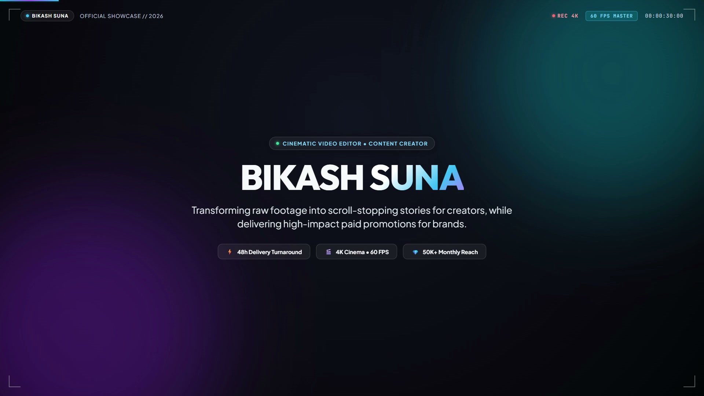
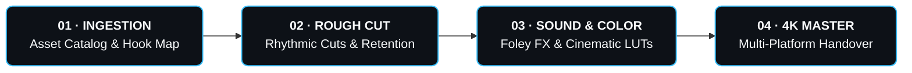

<div align="center">

  <!-- Dynamic Animated Hero Banner -->
  

  <p align="center">
    <strong>The next-generation cinematic portfolio & commercial brand collaboration platform for Bikash Suna.</strong><br />
    Engineered with <strong>React 18</strong>, <strong>Three.js (WebGL 3D)</strong>, <strong>Lenis Smooth Scroll</strong>, and a bespoke <strong>Cyber Cinema Glassmorphic Design System</strong>.
  </p>

  <!-- Live Status & Technology Badges -->
  <p align="center">
    <a href="https://bikash-suna-portfolio.vercel.app/"></a>
    <a href="https://react.dev/"></a>
    <a href="https://threejs.org/"></a>
    <a href="https://vitejs.dev/"></a>
    <a href="https://github.com/darkroomengineering/lenis"></a>
    <a href="https://wa.me/919360870164"></a>
    <a href="#-license"></a>
  </p>

  <!-- Quick Action Navigation Badges -->
  <p align="center">
    <a href="https://bikash-suna-portfolio.vercel.app/">
      
    </a>
    &nbsp;
    <a href="https://wa.me/919360870164?text=Hi%20Bikash,%20I'm%20interested%20in%20hiring%20you%20for%20a%20project!">
      
    </a>
    &nbsp;
    <a href="#-core-features--architecture">
      
    </a>
    &nbsp;
    <a href="#-service-rate-matrix">
      
    </a>
    &nbsp;
    <a href="#-deployment-guide-vercel--production">
      
    </a>
  </p>

  <p align="center">
    🔗 <strong>Deployed Web URL:</strong> <a href="https://bikash-suna-portfolio.vercel.app/"><strong>https://bikash-suna-portfolio.vercel.app/</strong></a>
  </p>

</div>

---

## 📑 Quick Navigation Hub

<a href="#-official-30-second-promotional-showcase-video"></a>
<a href="#-executive-overview"></a>
<a href="#-1-interactive-3d-webgl-gyro--particle-universe"></a>
<a href="#-2-cinematic-hero--pure-diamond-ice-white-typography"></a>
<a href="#-3-dual-superpowers--two-passions-one-powerful-creator"></a>
<a href="#-4-cinema-studio-video-player--persistent-controls"></a>
<br/>
<a href="#-5-filterable-showreel-showcase"></a>
<a href="#-video-assets--custom-media-management"></a>
<a href="#-6-creator-media-kit--live-analytics-desk"></a>
<a href="#-service-rate-matrix"></a>
<a href="#-7-clean-luxury-contact--instant-payments-suite"></a>
<a href="#-8-right-sided-floating-whatsapp-concierge"></a>
<a href="#-deployment-guide-vercel--production"></a>

---

## 🎬 Official 30-Second Promotional Showcase Video

A custom-rendered, cinema-grade 30-second promotional showcase video is bundled directly within the workspace under [`brag-output/`](brag-output/):

<div align="center">
  <a href="brag-output/brag.mp4">
    
  </a>
  <p><em>Click to play <code>brag-output/brag.mp4</code> — 1080p @ 30 FPS • Ultra-High Bitrate • Master Audio Sync</em></p>
</div>

### 📦 Video Deliverables & Specs
* 🎥 **Video File**: [`brag-output/brag.mp4`](brag-output/brag.mp4) (30.0s, 1920x1080 Full HD @ 30 FPS, H.264 High Profile / AAC Stereo, 1360 kbps)
* 🖼️ **Settled Poster Frame**: [`brag-output/brag.jpg`](brag-output/brag.jpg) (Bake-in on Frame 0 for instant social preview across all players)
* ⚙️ **Hyperframes Source Composition**: [`brag-output/composition/index.html`](brag-output/composition/index.html) (Deterministic GSAP 3 animation timeline)
* 📝 **Ready-to-Post Copy**: [`brag-output/share-copy.txt`](brag-output/share-copy.txt) & [`brag-output/share-copy-variants.md`](brag-output/share-copy-variants.md) (Platform-tailored captions for LinkedIn, Instagram Reels, and direct sponsor pitches)
* 📋 **Production Plan & Storyboard**: [`brag-output/brag-plan.md`](brag-output/brag-plan.md)

### ⏱️ Video Storyboard (30.0s Timeline Arc)
1. **Act 1 (0.0s – 4.5s) — Cinematic Hook & Brand Intro**: Futuristic camera viewfinder HUD brackets (`REC ● 4K 60FPS`), status pill, and bold title reveal with 3D ambient glows.
2. **Act 2 (4.5s – 9.5s) — Master NLE Timeline Showcase**: Real studio workstation photography paired with the live multi-track NLE deck (`BIKASH_MASTER_CUT_4K.prproj`, ProRes 422 HQ) and sweeping red laser playhead.
3. **Act 3 (9.5s – 14.5s) — Dual Superpowers**: Side-by-side comparison of **The Video Editor** (Velocity curves, kinetic captions, 3D LUT grading) and **The Content Creator** (Sponsored reels, product showcases, link stickers, 50K+ reach).
4. **Act 4 (14.5s – 19.5s) — Creator Media Kit & Verified Metrics**: Live animated metric cards (**50K+** Reach, **15K–45K** Views, **8.4%** Engagement, Gen-Z demographics) and the 4-step campaign lifecycle.
5. **Act 5 (19.5s – 25.0s) — Interactive Project Calculator**: Simulated UI interaction selecting project formats and toggling Express Delivery & Sound Design with live price recalculation (**₹600 ➔ ₹800 ➔ ₹950**).
6. **Act 6 (25.0s – 30.0s) — Final Brand Reveal & Direct Booking**: Avatar lockup, 48h turnaround chip, WhatsApp concierge booking CTA pill, and graceful audio fade.

---

## 🌟 Executive Overview

This web platform is engineered as an ultra-high-end cinematic portfolio, creative showcase, and commercial booking desk for **Bikash Suna**. It reflects both complementary superpowers of his creative career:

1. **Elite Video Editor & Post-Production Specialist**: Precision narrative storytelling, retention-driven cuts, cinematic DaVinci color grading, immersive sound design, and viral pacing for short-form Sambalpuri Reels, viral social edits, and long-form music video & documentary edits.
2. **High-Impact Content Creator & Brand Partner**: Authentic lifestyle & regional storytelling, verified creator presence, transparent media kit retention analytics, and instant direct brand collaboration funnels.

Every interaction has been fine-tuned for visual excellence, fluid 60FPS motion, zero input latency, responsive cross-device geometry, and seamless conversion-optimized client onboarding.

---

## ⚡ Core Features & Architecture

### 🌌 1. Interactive 3D WebGL Gyro & Particle Universe
* **Three.js Powered Viewport**: Real-time 3D canvas featuring concentric neon gimbal rings, a central camera aperture core, and an ambient celestial particle galaxy.
* **Physics Cursor Tracking**: Gyroscopic orientation responds dynamically to cursor coordinates on desktop, with continuous automated orbital drifting on touchscreens.
* **Smart Resource Management**: Frame render loop automatically pauses when the video modal is active or scrolled out of view, reserving 100% GPU bandwidth for smooth 60FPS video playback.

### 🎬 2. Cinematic Hero & Pure Diamond Ice-White Typography
* **High-Contrast Headline Typography**: The rotating typewriter titles (*"Influential Content Creator"*, *"Cinematic Video Editor"*, *"Viral Reel Specialist"*, *"Brand Collab Partner"*) are rendered in a bespoke **Pure Diamond Ice-White with Platinum Glow** gradient (`#FFFFFF` &rarr; `#F8FAFC` &rarr; `#E2E8F0` &rarr; `#CBD5E1`).
* **Multi-Depth Platinum Aura**: Layered drop shadows guarantee 100% legibility against dark studio backgrounds.
* **Studio Production Monitor & Multi-Track NLE Timeline HUD**: Real-time visualizer deck featuring Premiere Pro and After Effects workflow previews, simulated playback controls, live frequency audio visualizers, and SMPTE timecode readouts.
* **Adaptive Dual-Tier Timeline Engine**: Automatically abbreviates track clip names and pipeline badges on mobile viewports (`320px` to `768px`) via `.timeline-desktop-only` tags to guarantee 0% horizontal clipping while retaining full detailed readouts on desktop monitors.
* **Fluid Category & Availability Pill**: Self-adjusting badge pill utilizing responsive `clamp()` typography and compact padding, guaranteeing the live pulsing green availability dot and creator title never truncate on narrow mobile screens.
* **Live Verified Metrics**: Dynamic animated counters tracking 120+ projects completed, 4.9★ rating, and 100% client retention.

### ⚡ 3. Dual Superpowers: "Two Passions. One Powerful Creator."
* **Pillar 01 — Elite Video Editor & Colorist**:
  * Pacing, kinetic captions, sound design, multi-cam sync, and cinematic color grading.
  * Master software suite badges: Premiere Pro, After Effects, DaVinci Resolve, CapCut Pro.
  * Direct pricing anchors: Short Reels from **₹600**, Long Form from **₹3,000**.
* **Pillar 02 — High-Impact Content Creator & Brand Partner**:
  * Authentic audience advocacy, high-converting product showcases, viral reel hook scripting, and macro product b-roll.
  * Verified distribution reach: **50K+ Monthly Audience Reach**, 98% retention, and 8.4% engagement.
  * Commercial Collab Model: Tailored brand sponsorship packages with **Custom Quote via DM / WhatsApp** based on campaign deliverables, product scope, and distribution reach.
  * Key Deliverables: Dedicated sponsored Reel authored by Bikash, official Instagram co-author post, 24h active story blast with direct conversion link sticker, and full end-to-end 4K production.
* **2-in-1 Synergy Banner**: Highlighting the hybrid Creator + Editor package for brands seeking all-in-one production, saving time and maximizing audience resonance.

### 📽️ 4. Cinema Studio Video Player & Persistent Controls
* **Studio Cinema Monitor Frame**: High-fidelity video player dialog with frosted glass header, glowing window status controls, and an active pulsing `REC` indicator.
* **Center Press-to-Stop & Play (Icon Only, Zero Text)**:
  * When paused: Prominent luxury play button with animated ambient ripple ring.
  * When playing: Frosted glass stop/pause button in the middle for instant stop.
  * Zero text labels (`STOP`, `PAUSE`, etc.)—purely clean, high-end iconography.
* **Smart Stream Quality Switching**:
  * Dynamic stream selector supporting **4K Ultra HD**, **1080p Full HD**, **720p HD (Fast)**, and **Auto**.
  * Mobile Device Awareness: Automatically defaults to lightweight 720p stream on mobile devices / narrow screens (`<= 768px`) for instant, bufferless, zero-lag playback, while allowing desktop users to enjoy high-bitrate 1080p/4K.
  * Instant position sync: Preserves playback timestamp seamlessly when switching resolutions.
* **Direct MP4 Download Action**:
  * Clean download pill cleanly located in the bottom controls dock.
  * Downloads the currently selected resolution MP4 with sanitized filename (`Title_1080p.mp4`).
* **Zero-Lag Direct DOM Performance**:
  * Direct DOM ref updates (`progressFillRef`, `currentTimeDisplayRef`, `hudTimecodeRef`) completely eliminate React re-renders during video playback, eliminating micro-stutters and frame drops.
* **Mobile-Safe Autoplay Engine**:
  * Adheres strictly to mobile browser policies with initial muted playback on mobile viewports and automatic error-recovery, preventing mobile video halts.
  * Full iOS WebKit support with `playsInline`, `webkit-playsinline="true"`, and `x5-playsinline="true"`.
* **Responsive Control Dock**:
  * Audio waveform bars hidden on mobile viewports to prevent control crowding.
  * Download button automatically adapts to a compact icon on mobile, guaranteeing 0% overlap between timecode and quality pills across all screens (`320px` to `4K`).

### 🎞️ 5. Filterable Showreel Showcase
* **Zero-Lag Category Filtering**: Instant switching between `All Work`, `Short Reels (9:16)`, `Long Albums (16:9)`, `Brand Collabs`, and `Cinematic Edits`.
* **Featured Showcase Titles**:
  * **Viral Sambalpuri Reels**: *"She Is Just My Best Friend"*, *"Mor Maa Mor Sansar"*, *"Pahela Nazar"*.
  * **Official Music Videos**: *"Babu Zaraa Bachke | Official Sambalpuri Rap MV"*.
  * **Commercial Brand Collabs**: *"Shree Soni Jewellers"*, *"Diwali & Dhanteras Mega Offer"*.
  * **Cinematic Edits (Before & After)**: *"A Moment in Motion"*, *"Unspoken Moments"*, *"Royal Elegance (Bridal)"*.
* **Hardware-Accelerated Transitions**: Pure opacity and transform scale animations eliminating blur artifacts during filter changes.
* **Luxury Studio Duration Pill**: Frosted glassmorphism duration badge (`backdrop-filter: blur(14px)`) integrated with a 3-bar animated rhythmic gradient sound frequency indicator.
* **Multi-Platform Direct Link Badges**: Sunset-pink Instagram direct links and crimson YouTube action links.

---

## 📁 Video Assets & Custom Media Management

The project is structured with dedicated media folders housing optimized web-ready MP4 video streams:

```bash
public/videos/
├── short-reels/     # Faststart 1080p & 720p reels (bestfriend-reel-opt, mor-maa-opt, pahela-nazar-opt, color-grade edits)
├── long-videos/     # Widescreen 16:9 albums & music videos (babu-zaraa-bachke)
└── brand-collabs/   # Sponsored brand deliverables (shree-soni-jewellers, diwali-dhanteras-offer)
public/thumbnails/   # High-resolution showreel posters (reel-1 to reel-6, collab-1, collab-2)
```

### Linking Videos in `src/data/projects.js`
All showcase items are managed in the centralized configuration file [src/data/projects.js](src/data/projects.js):

```javascript
{
  id: 'reel-1',
  category: 'reel', // 'reel' (9:16) | 'album' (16:9) | 'collab' | 'edited'
  title: 'She Is Just My Best Friend | Sambalpuri Reel',
  desc: 'Conversational pacing, cinematic framing, and clean dialogue transitions.',
  img: 'assets/thumbnails/reel-1.jpg',
  videoUrl: '/videos/short-reels/bestfriend-reel-opt.mp4',
  externalUrl: 'https://www.instagram.com/reel/DIx7upbzs2B/',
  tags: ['Dialogue Editing', 'Sambalpuri Reel', 'Visual Pacing'],
  badge: 'Short Reel',
  color: 'cyan',
  duration: '1:13',
}
```

> [!TIP]
> **Windows Watcher Optimization**: Heavy video files in `public/` are ignored by Vite's file watcher in `vite.config.js` to prevent Windows file locking (`EBUSY`) issues while maintaining ultra-fast HMR for all code and style edits.

---

## 📊 6. Creator Media Kit & Live Analytics Desk
* **Interactive SVG Sparkline Trends**: Dynamic SVG stroke curves visualizing consistent 30-day reach expansion across viral Reels and Shorts.
* **Retention & Engagement Matrix**: Transparent, verified metrics displaying 50K+ Monthly Reach, 85%+ Watch Retention, and 8.4% Average Engagement (3.2x industry benchmark).
* **Demographic Breakdown**: Visual ratio indicator showing core Gen-Z and Millennial audience (72% active age 18–28) with high digital purchasing power.
* **4-Step Campaign Lifecycle**:
  * `01` **Briefing & Goal Alignment** (Day 1 • Blueprint): Target audience definition, USP discovery, and campaign CTA lock.
  * `02` **Scripting & Hook Engineering** (Day 1–2 • Script Draft): First 3-second retention lock and narrative pacing tailored to maximize watch time.
  * `03` **Cinematic Shooting & Editing** (Day 2 • 4K Production): 4K capture, speed ramping, beat syncing, vocal leveling, and custom LUT color grading.
  * `04` **Review & Collaborative Launch** (Day 3 • Live Campaign): Final cut review, official Instagram Co-Author Reel publishing, and targeted story link stickers.
* **Luxury Mobile-Responsive Sponsor CTA Banner**:
  * Real-time availability pill with a live pulsing green indicator (*"SPONSOR SLOTS OPEN FOR THIS MONTH"*), engineered with flexbox `min-width: 0` protection and multiline wrapping defense.
  * Professional collaboration model (*"DM for Collaboration"*), highlighting tailored deliverables with 4K video production, viral hook scripting, and verified Instagram co-authorship.
  * Full-width mobile CTA button (*"DM for Collaboration"*) launching directly into WhatsApp with pre-configured campaign parameters.

---

## 💳 7. Clean Luxury Contact & Instant Payments Suite
* **Direct Commercial Booking Hub**:
  * **Direct WhatsApp Chat**: Dedicated emerald-styled direct chat row with pre-filled greeting (`+91 9360870164`).
  * **WhatsApp Sponsor Desk**: Instant chat specifically configured for brand collaborations.
  * **One-Click Mobile Call**: Immediate direct phone access (`+91 9360870164`).
  * **Instagram Creator Profile**: Official sunset-violet gradient badge routing directly to `@bikash_suna_07`.
  * **Studio Location**: Jharsuguda, Odisha, India.
* **Cyber Cinema UPI Desk**:
  * **1-Click Mobile-Responsive UPI VPA Copy**: High-contrast, touch-optimized copy button for official UPI ID (**`9360870164@superyes`**).
  * **Verified Payee Indicator**: Displays official payee name **BIKASH SUNA** with a verified status badge and `super.money` badge.
  * **Real Scannable Super.money QR Code**: High-contrast, scannable QR code enclosed in an animated futuristic viewfinder with sweeping neon laser scan and bracket reticles.
  * **Tap to Pay via UPI App**: Native mobile deep link (`upi://pay?pa=9360870164@superyes&pn=Bikash%20Suna&cu=INR`) that instantly launches default payment apps on smartphones.
  * **Confirm Payment on WhatsApp**: Direct 1-tap confirmation action allowing clients to immediately share payment screenshots on WhatsApp for instant project kickoff.
  * **Supported UPI Apps**: Official badges for **Google Pay**, **PhonePe**, **Paytm**, **super.money**, and **BHIM UPI**.

---

## 💬 8. Interactive Floating WhatsApp Automation Concierge
* **Optimal Right-Side Placement**: Anchored cleanly at `bottom: 2rem; right: 2rem;` on desktop and symmetrically at `bottom: 1.25rem; right: 1.25rem;` (`48px`) on mobile viewports.
* **Personalized Regional Greeting**:
  > *"Namaskar! 🙏 Welcome to Bikash Suna Official Studio. Whether you want to edit a Viral Sambalpuri Reel (₹600), Full Cinematic Video Album (₹3000), or Brand Sponsorship Collab, choose a quick option below to chat directly with me on WhatsApp:"*
* **Full-Scope Project Automation Presets**:
  1. **Viral Reel Edit (₹600)**: Direct inquiry for viral reel editing with speed ramps and sound design.
  2. **Cinematic Video Album (₹3000)**: Full narrative editing for wedding films, music videos, and 4K story arcs.
  3. **Brand Sponsor & Collab (Paid Promo)**: Dedicated prompt for agencies and brands reaching out for sponsored content on [@bikash_suna_07](https://instagram.com/bikash_suna_07).
  4. **Inquire Portfolio Showreels**: Instant inquiry referencing the cinematic showreels and color grading.
  5. **Custom Quote / Calculator Estimate**: Direct connect for multi-video quotes generated by the pricing calculator.
  6. **Rush 24h Express Turnaround**: Urgent 24–48h express delivery request.
* **Instant 1-Click WhatsApp Launch**:
  * Clicking any preset option **immediately opens WhatsApp** in 1-click with the custom inquiry pre-filled and ready to send.
  * Zero fake chatbot delay, zero typing bubble latency, and 100% immune to mobile browser popup-blockers.
* **Instant Custom Inquiry Input**: Integrated chat input footer allowing visitors to type bespoke requirements or rates and open WhatsApp in 1-click.

---

## 💰 Service Rate Matrix

Transparent, upfront pricing packages designed for immediate commercial decision-making:

| Service Package | Format & Scope | Turnaround | Commercial Rate |
| :--- | :--- | :--- | :---: |
| **⚡ Viral Short Reel** | 9:16 vertical, hook retention pacing, sound design, kinetic subtitle timing, color grading | 24h – 48h | **₹600** / reel |
| **🎬 Cinematic Video Album** | 16:9 cinematic, multi-cam sync, master sound mix, B-roll pacing, custom LUT grade | 48h – 72h | **₹3,000** / video |
| **🤝 Paid Promotion & Brand Collab** | 1 Dedicated sponsored Reel authored by Bikash, Instagram Co-Author & Tagged Collab, 24h story blast with link sticker, hook scripting, product B-roll, 4K edit & sound design (50K+ Reach) | 48h – 72h | **DM for Collaboration** (Custom Quote) |
| **🚀 Rush 24h Express Turnaround** | Priority rendering queue, dedicated revision window, same-day draft | 24 Hours | **Add-on** |

---

## 🛠️ 4-Phase Creative Production Pipeline


```mermaid
flowchart LR
    P1["<b>01 · INGESTION</b><br/>Asset Catalog & Hook Map"] --> P2["<b>02 · ROUGH CUT</b><br/>Rhythmic Cuts & Retention"]
    P2 --> P3["<b>03 · SOUND & COLOR</b><br/>Foley FX & Cinematic LUTs"]
    P3 --> P4["<b>04 · 4K MASTER</b><br/>Multi-Platform Handover"]

    classDef stage fill:#0d1117,stroke:#38bdf8,stroke-width:1.5px,color:#f8fafc,rx:8,ry:8;
    class P1,P2,P3,P4 stage;
```

| Phase | Milestone | Core Technical Scope | Key Deliverables | Timeline |
| :---: | :--- | :--- | :--- | :---: |
| `01` | **Ingestion & Storyboarding** | Asset cataloging, camera roll curation, narrative hook mapping & audio beat sync | Curated footage bin & timeline storyboard | Day 1 |
| `02` | **Rough Cut & Retention Pacing** | Rhythmic timeline assembly, retention-driven transitions, micro-zooms, kinetic caption timing | First-pass review cut & pacing draft | Day 1–2 |
| `03` | **Sound Design & Color FX** | Atmospheric foley, cinematic risers, vocal leveling & custom multi-curve LUT grading | Master audio mix & fully graded sequence | Day 2 |
| `04` | **4K Master & Final Delivery** | High-bitrate 4K encoding (9:16 vertical & 16:9 widescreen), compression compliance & cloud handover | Final 4K masters ready for publishing | Day 2–3 |

---

## 💻 Tech Stack & Dependencies

| Category | Technology | Rationale & Purpose |
| :--- | :--- | :--- |
| **UI Framework** | [React 18.3](https://react.dev/) | Modular component architecture, efficient state hooks, declarative rendering |
| **3D Graphics** | [Three.js 0.170](https://threejs.org/) | WebGL particle galaxy, concentric gimbal rings, physics cursor tracking |
| **Smooth Scroll** | [Lenis 1.3](https://github.com/darkroomengineering/lenis) | Apple-grade exponential deceleration smooth scrolling |
| **Tooling & Bundler** | [Vite 6.0](https://vitejs.dev/) | Sub-second HMR development server and optimized Rollup production builds |
| **Styling** | Vanilla CSS3 / HSL Tokens | Custom glassmorphism, responsive flex/grid layouts, zero CSS framework overhead |
| **Icons** | [FontAwesome 6](https://fontawesome.com/) | Scalable vector icons for studio controls, verified badges, and social media |
| **Typography** | [Google Fonts](https://fonts.google.com/) | *Outfit* (headings & displays) + *Plus Jakarta Sans* (body text) |

---

## 📂 Comprehensive Project Structure

```bash
Bikash-Suna-Portfolio/
├── assets/                         # Source graphics & hero imagery
│   ├── album.jpg                   # Long Album cover artwork
│   ├── babu-zaraa-bachke.jpg        # Album poster artwork
│   ├── hero.jpg                    # Studio hero environment photograph
│   ├── payment-qr-card.png         # UPI preview card
│   ├── payment-qr-code.png         # Scannable super.money payment QR
│   ├── profile.jpg                 # Creator portrait
│   ├── reel.jpg                    # High-energy reel preview thumbnail
│   └── thumbnails/                 # Showreel poster artwork (reel-1 to reel-6, collab-1, collab-2)
├── public/                         # Static assets served at root
│   ├── assets/                     # Public web assets, thumbnails & QR codes
│   ├── thumbnails/                 # Showreel poster artwork
│   └── videos/                     # Optimized MP4 video streams
│       ├── short-reels/            # Short reels (bestfriend-reel-opt, mor-maa-opt, pahela-nazar-opt, color-grade edits)
│       ├── long-videos/            # Long video albums (babu-zaraa-bachke)
│       └── brand-collabs/          # Brand collabs (shree-soni-jewellers, diwali-dhanteras-offer)
├── src/
│   ├── components/
│   │   ├── Navbar.jsx              # Frosted glass responsive header with mobile drawer
│   │   ├── Hero.jsx                # Cinematic dual-persona hero with live stats
│   │   ├── ThreeCanvas.jsx         # WebGL 3D gyro rings & particle galaxy
│   │   ├── ScrollingTicker.jsx     # Seamless infinite brand marquee ticker
│   │   ├── DualPillars.jsx         # Editor vs Creator dual specialization cards
│   │   ├── About.jsx               # Creative journey, software masteries & snapshot
│   │   ├── CreatorMediaKit.jsx     # Creator metrics, demographic statistics & sparklines
│   │   ├── Portfolio.jsx           # Filterable 4K showreel gallery with luxury duration pills
│   │   ├── VideoModal.jsx          # Studio cinema player with persistent controls, quality switch & mobile engine
│   │   ├── Services.jsx            # Transparent rate cards (Reels ₹600, Albums ₹3000, Collabs via DM)
│   │   ├── Contact.jsx             # Direct sponsor desk, UPI copy node & laser QR scanner
│   │   ├── Footer.jsx              # Brand footer with navigation & copyright
│   │   └── FloatingWhatsApp.jsx    # Right-sided interactive WhatsApp concierge with persistent presets
│   ├── data/
│   │   └── projects.js             # Centralized showreel project data & video links
│   ├── App.jsx                     # Core application orchestrator & Lenis controller
│   ├── main.jsx                    # React 18 DOM mount point
│   └── index.css                   # Unified glassmorphism & cyber dark-mode design system
├── .env.example                    # Template environment variables
├── .env                            # Local environment configuration
├── index.html                      # HTML5 entry with meta SEO & viewport setup
├── package.json                    # Dependencies & build scripts
├── vite.config.js                  # Vite configuration & watcher optimization
└── README.md                       # Comprehensive documentation
```

---

## 🌐 Live Production Deployment & Hosting

> ### 🚀 Live Production URL
> **[https://bikash-suna-portfolio.vercel.app/](https://bikash-suna-portfolio.vercel.app/)**
> 
> *Deployed on Vercel Edge Network with sub-second asset streaming and automatic continuous deployment via GitHub.*

Deploying or updating the portfolio takes less than 60 seconds with **Vercel**:

### Option 1: Automatic Deployment via Git (Recommended)
1. Push your latest code to GitHub:
   ```bash
   git add .
   git commit -m "portfolio"
   git push origin main
   ```
2. Go to [Vercel](https://vercel.com/) and log in with GitHub.
3. Click **"Add New Project"** &rarr; **"Import"** `Gautamgiri798/Bikash-Suna-Portfolio`.
4. Vercel automatically detects **Vite**:
   - **Framework Preset**: `Vite`
   - **Build Command**: `npm run build`
   - **Output Directory**: `dist`
   - **Install Command**: `npm install`
5. Click **"Deploy"**. Any future `git push origin main` triggers automatic builds and zero-downtime updates.

### Option 2: Deploy via Vercel CLI
```bash
npm install -g vercel
vercel
```
Follow the interactive prompts to deploy directly from your local terminal.

---

## 🚀 Getting Started & Local Setup

Get the portfolio running locally on your workstation in under two minutes:

### Prerequisites
Ensure you have [Node.js](https://nodejs.org/) (**v18.0.0** or later) and `npm` installed:
```bash
node -v
npm -v
```

### 1. Clone the Repository
```bash
git clone https://github.com/Gautamgiri798/Bikash-Suna-Portfolio.git
cd Bikash-Suna-Portfolio
```

### 2. Configure Environment Variables
Copy the sample environment file:
```bash
cp .env.example .env
```

### 3. Install Dependencies
```bash
npm install
```

### 4. Launch Development Server
```bash
npm run dev
```
Open your browser and navigate to:
👉 **`http://localhost:5173`**

### 5. Build for Production
Create an optimized production bundle in the `dist/` directory:
```bash
npm run build
```

### 6. Preview Production Build Locally
```bash
npm run preview
```

---

## ⚙️ Customization Guide

Easily tailor this codebase for your personal branding or client project:

| Configuration Area | File Location | What to Update |
| :--- | :--- | :--- |
| **Showreel Projects & Links** | `src/data/projects.js` | Add video links, descriptions, tags, and badges. |
| **Promotional Showcase Video** | `brag-output/` | Re-render launch video (`brag.mp4`), poster (`brag.jpg`), or modify `composition/index.html`. |
| **WhatsApp Desk Number** | `src/components/FloatingWhatsApp.jsx` | Change `919360870164` to your international phone number. |
| **Quick Action Presets** | `src/components/FloatingWhatsApp.jsx` | Modify automated preset chips, message labels, and rates. |
| **UPI Payment ID** | `src/components/Contact.jsx` | Update `9360870164@superyes` (super.money) and phone number to your VPA. |
| **Contact Channels** | `src/components/Contact.jsx` | Adjust phone, WhatsApp, Instagram username, and studio location. |
| **Service Packages & Rates** | `src/components/Services.jsx` | Adjust prices and feature lists for Reels, Albums, and Collabs. |
| **Audience Media Kit** | `src/components/CreatorMediaKit.jsx` | Update impressions, engagement percentages, and follower stats. |
| **Footer & Touchpoints** | `src/components/Footer.jsx` | Update brand statement, navigation anchors, and direct contact channels. |
| **Color Tokens & Glows** | `src/index.css` | Customize `:root` CSS variables (`--color-accent-purple`, `--color-accent-teal`, etc.). |

---

## ⚡ Performance & Optimization Standards

- **Zero Bloat Frameworks**: 100% vanilla CSS tokens with zero Tailwind or Bootstrap runtime overhead.
- **Hardware-Accelerated Transforms**: Modals, hover elevations, and 3D rotations utilize `transform: translate3d()` and `will-change` hints for smooth 60FPS execution.
- **Dynamic 3D Throttling**: WebGL frame loops pause automatically when the video modal is open to preserve CPU/GPU overhead.
- **Zero-Overflow Mobile Geometry**: Strict `min-width: 0` flex constraints, adaptive typography clamps, harmonized nested container paddings, and responsive viewports guarantee 0 horizontal scrolling across all mobile devices (320px to 480px+).
- **Persistent Video Controls & Center Stop**: Custom HTML5 media player controls with center press-to-stop/play and clean icon-only design.
- **Mobile Video Engine**: Automatic detection of mobile screens to stream lightweight 720p streams with muted autoplay compliance and zero-render DOM ref timecode updates.
- **Semantic HTML5 & Accessibility**: Fully semantic element structure (`<header>`, `<main>`, `<section>`, `<aside>`, `<footer>`), valid `aria-label` tags, and accessible contrast ratios.

---

## 🤝 Commercial Bookings & Contact

For brand sponsorships, video editing projects, or creative inquiries:

<div align="center">

| Channel | Details / Action |
| :--- | :--- |
| **🌐 Live Portfolio** | [**https://bikash-suna-portfolio.vercel.app/**](https://bikash-suna-portfolio.vercel.app/) |
| **WhatsApp Sponsor Desk** | [](https://wa.me/919360870164) |
| **Direct Phone Call** | `+91 9360870164` |
| **Instagram Official** | [@bikash_suna_07](https://www.instagram.com/bikash_suna_07/) |
| **Instant UPI Desk** | `9360870164@superyes` *(GPay, PhonePe, Paytm, super.money, BHIM)* |
| **Studio Location** | Jharsuguda, Odisha, India |
| **Turnaround** | Express 24h &bull; Standard 48h–72h |

</div>

---

## 📄 License

This project is open source and available under the **[MIT License](LICENSE)**.

<div align="center">
  <sub>Crafted with passion for cinema, story, and high-performance web engineering. &copy; 2026 Bikash Suna. All rights reserved.</sub>
</div>
